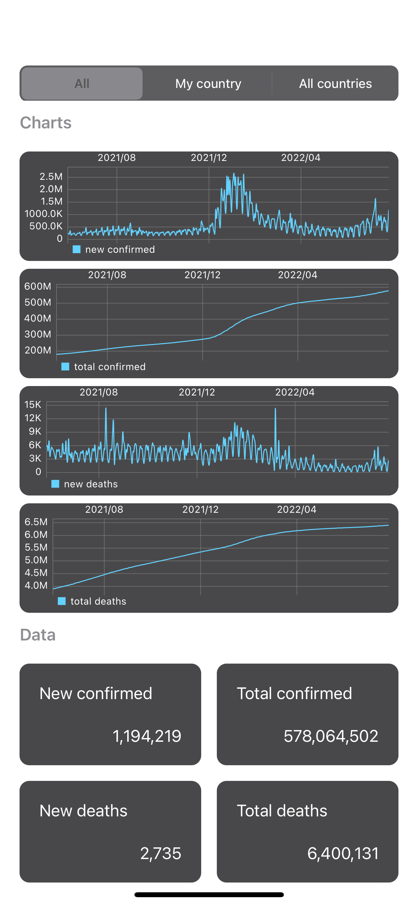
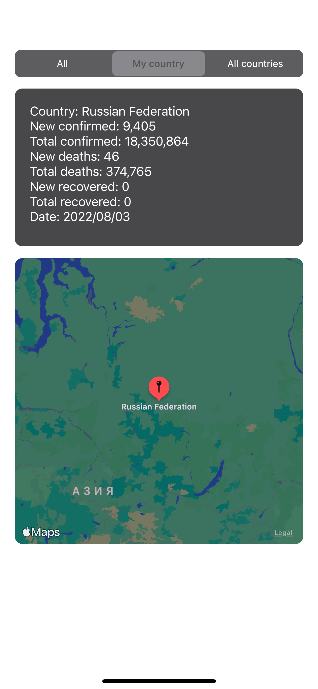
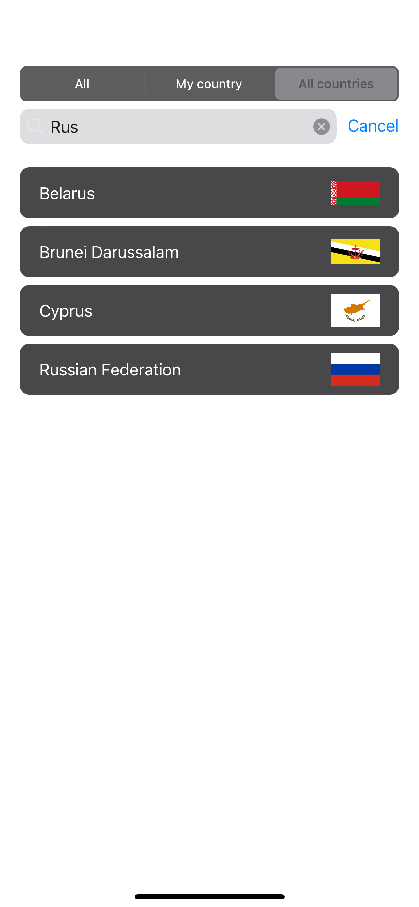

Проект для просмотра COVID заболевших в любой стране.  
Проект сделан на архитектурном паттерне MVP.  
Структура проекта:   
* Начинается все с экрана он-бординга, где показываются "фичи приложения". Используется готовая библиотека Paper-on-boarding 
Имеется возможность листать страницы, или пропустить все и сразу перейти к приложению.

* Далее попадаем на "главный экран", где отображаются данные из [API](https://documenter.getpostman.com/view/10808728/SzS8rjbc#27454960-ea1c-4b91-a0b6-0468bb4e6712).
Четыре графика по категориям за все время наблюдения и общее количество по категориям за все время наблюдения.
Сверху 3 UISegmentedControll, которые позволяют переключаться между 3 экранами "All", "My country" и "All countries" используя UIPageViewController.  
"My country" - отображает актуальные данные по выбранной стране пользователя общие (за все время).  
"All countries" выводит список всех стран c флагом страны и позволяет искать страны через search bar.   
* При запуске приложения данные из API сохраняются в CoreData. Если запускается приложение в оффлайн режиме, то данные берутся из CoreData.
* По выбору страны из списка - открывается детальный экран с инфой по этой стране и местоположение страны на карте.
* Для запросов  в сеть используется [Moya](https://cocoapods.org/pods/Moya).
* Для получения картинок флагов используется [SDWebImage]
* Используются Unit-тесты, а так же UI тесты

### Скрины экранов

